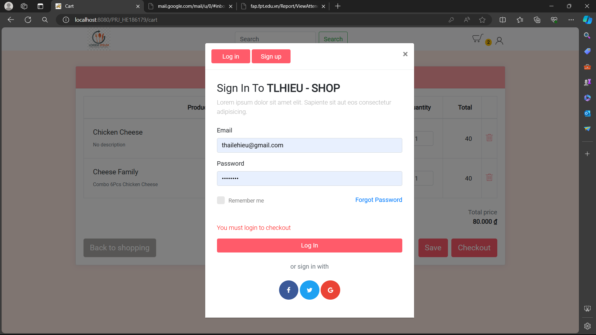
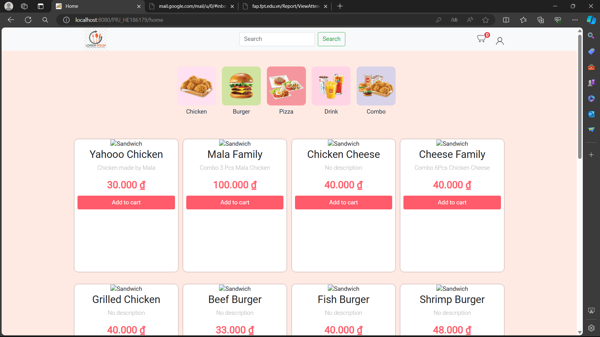
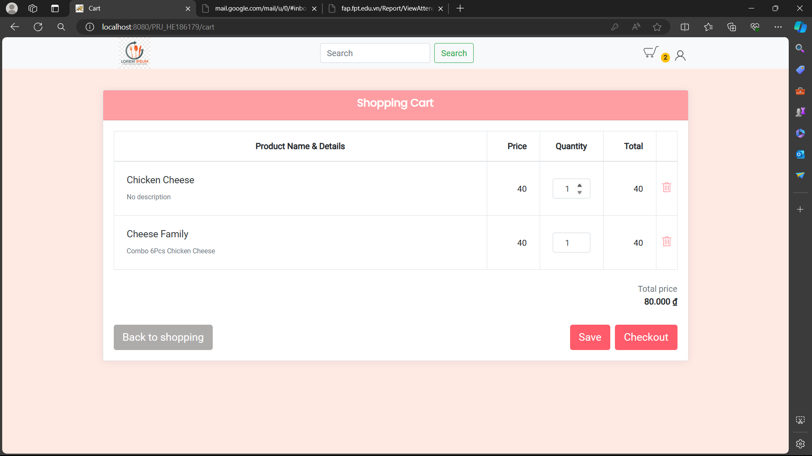
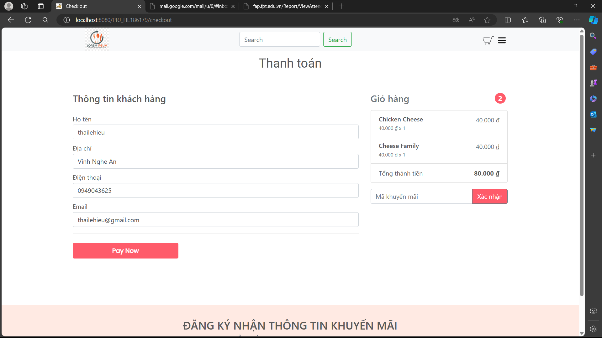
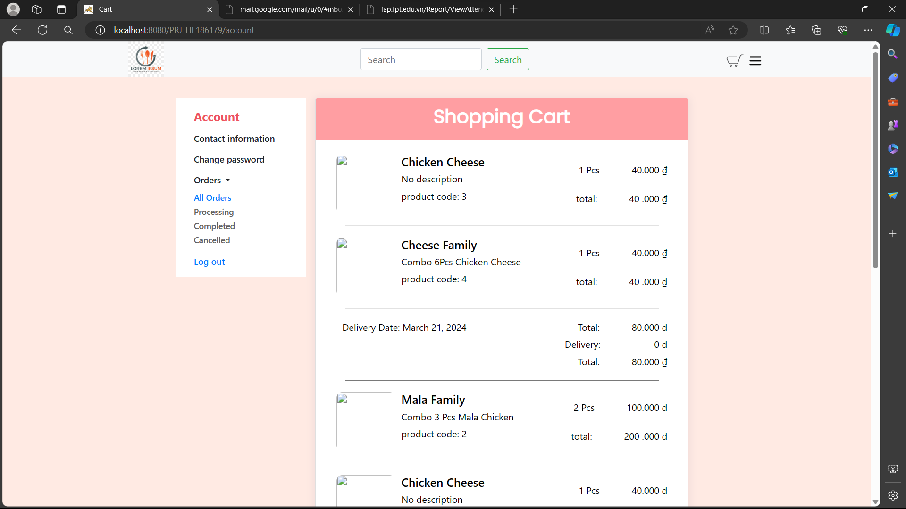
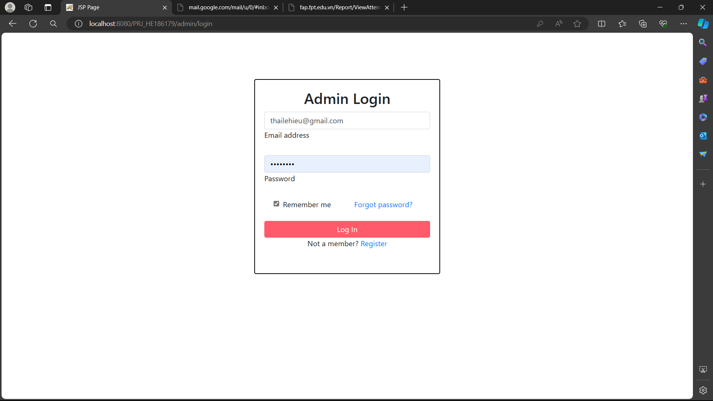
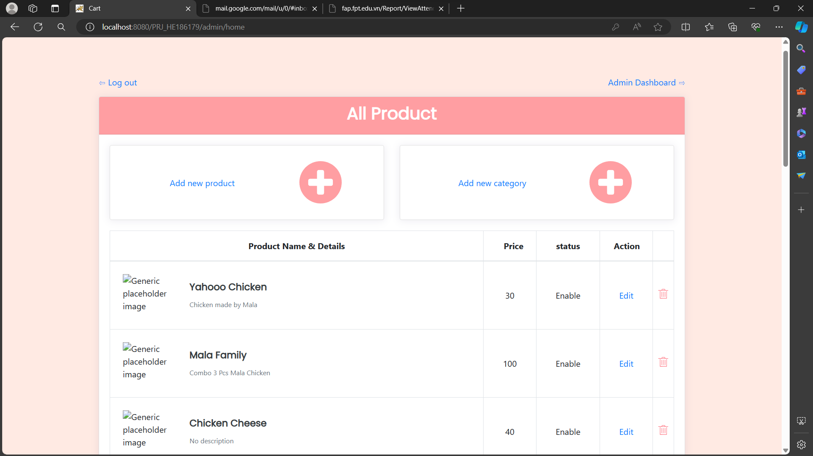
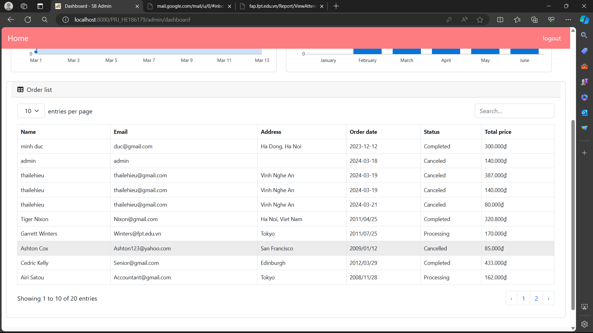

## PRJ301_HE186179 Hieutritue
Project Java Web Using Servlet

## How to run

1. Setup database: copy file sql in Database folder and run in SQL Server
2. Change user and pass (path: /src/java/dal/DbContext.java)
3. Add 3 library: jstl-2.0.0, sjtl-api-2.0.0, sqljdb42 
4. Run peoject 

## How to use
**account** (username: admin | password: 1)
### User
path/home: display all product with feature(add to cart, fillter by category, login, signup)

path/account: change account information, display purchase history

path/cart: view cart

path/checkout: checkout order

### Admin
path/admin/home: display all product, update product

path/admin/updateProduct: update product

path/admin/dashboard: show dashboard

### User page

#### User login

#### Display page

#### User cart

#### User checkout

#### User orders

### Amin page

#### Admin login

#### Item management site

#### Admin dashboard

